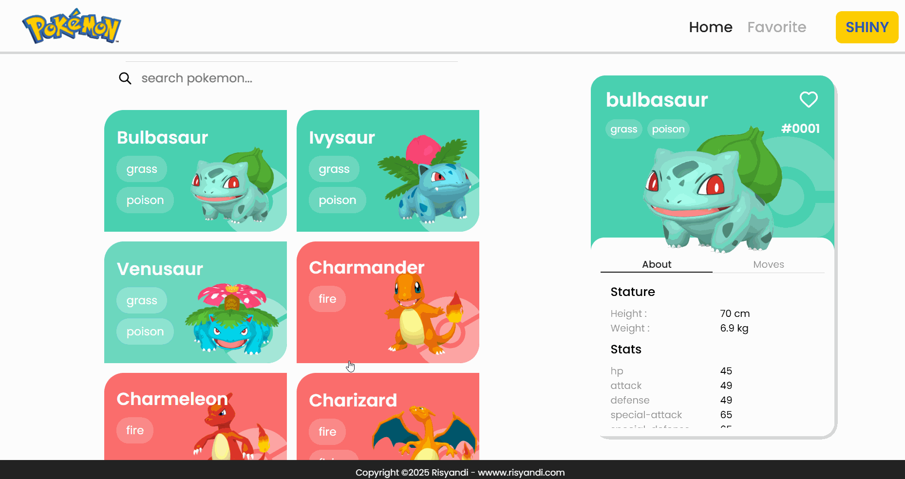

# 🎮 Pokemondex

A modern, interactive Pokemon encyclopedia built with React that allows users to explore, search, and manage their favorite Pokemon.



## ✨ Features

- **🔍 Pokemon Search**: Search for any Pokemon by name or ID
- **📱 Responsive Design**: Mobile-friendly interface with modern UI
- **⭐ Favorites System**: Save and manage your favorite Pokemon
- **✨ Shiny Mode**: Toggle between regular and shiny Pokemon sprites
- **📊 Detailed Information**: View comprehensive Pokemon stats, types, and moves
- **Infinite Scroll**: Load more Pokemon as you scroll
- **Local Storage**: Favorites are saved locally in your browser

## 🚀 Tech Stack

- **React** 18.2.0 - Modern React with hooks
- **React Router DOM** 6.16.0 - Client-side routing
- **Node Sass** 9.0.0 - SCSS preprocessing
- **PokeAPI** - Pokemon data source
- **Local Storage** - Client-side data persistence

## 📁 Project Structure

```tree
src/
├── components/
│   ├── Card/           # Pokemon card display component
│   ├── PokemonCard/    # Detailed Pokemon information modal
│   │   ├── About.jsx   # Pokemon stats and info
│   │   ├── Moves.jsx   # Pokemon moves list
│   │   └── style.scss  # Component styles
│   └── Search/         # Search functionality
├── pages/
│   ├── Homepage.js     # Main Pokemon listing page
│   └── Favoritepage.js # Favorites management page
├── icons/              # SVG icons and assets
├── assets/             # assets of App images and logos
├── Layout.jsx          # Main layout wrapper
└── App.js             # Main application component
```

## 🎯 Key Features Explained

### Pokemon Search

- Real-time search using PokeAPI
- Search by Pokemon name or ID
- Instant results with error handling

### Pokemon Cards

- Display Pokemon with sprites and names
- Click to view detailed information
- Support for both regular and shiny variants

### Detailed View

- **About Tab**: Base stats, types, height, weight
- **Moves Tab**: Complete move list with details
- **Favorite System**: Heart icon to save Pokemon

### Favorites Management

- Dedicated favorites page
- Local storage persistence
- Easy add/remove functionality

## 🛠️ Installation & Setup

### Prerequisites

- Node.js (version 20)
- npm

### Getting Started

1. **Clone the repository**

   ```bash
   git clone <repository-url>
   cd pokemondex
   ```

2. **Install dependencies**

   ```bash
   npm install
   ```

3. **Start the development server**

   ```bash
   npm start
   ```

4. **Open your browser**
   Navigate to `http://localhost:3000`

### Available Scripts

- `npm start` - Runs the app in development mode
- `npm build` - Builds the app for production
- `npm test` - Launches the test runner
- `npm eject` - Ejects from Create React App (one-way operation)

## 🌐 API Integration

This app integrates with the [PokeAPI](https://pokeapi.co/), a free Pokemon database that provides:

- Pokemon basic information
- Sprites and images
- Stats and abilities
- Move sets and types

## 🎨 Styling

The application uses SCSS for styling with:

- Modern CSS Grid and Flexbox layouts
- Responsive design principles
- Pokemon type-based color schemes
- Smooth animations and transitions

## 🖥️ Browser Support

- Chrome (latest)
- Firefox (latest)
- Safari (latest)
- Edge (latest)

## 🤝 Contributing

1. Fork the repository
2. Create a feature branch (`git checkout -b feature/amazing-feature`)
3. Commit your changes (`git commit -m 'Add amazing feature'`)
4. Push to the branch (`git push origin feature/amazing-feature`)
5. Open a Pull Request

## 📄 License

This project is licensed under the MIT License - see the LICENSE file for details.

## Acknowledgments

- [PokeAPI](https://pokeapi.co/) for providing Pokemon data
- React team for the amazing framework
- Pokemon Company for the Pokemon franchise

## 📞 Support

If you encounter any issues or have questions:

- Open an issue on GitHub
- Check the existing documentation
- Review the code comments for implementation details

---

Happy Pokemon hunting! 🎮✨
